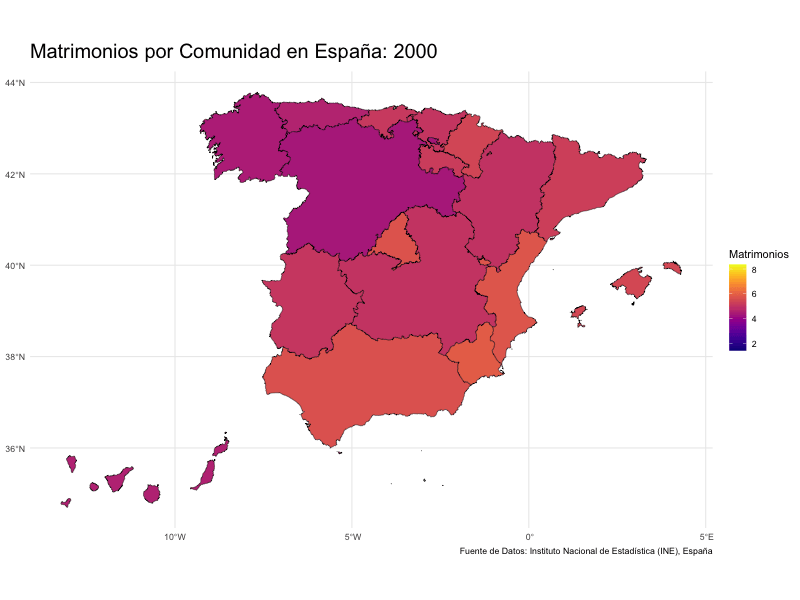

## Tasa de Matrimonios

La tasa de nupcialidad se obtiene calculando el número total de matrimonios registrados durante un año y dividiéndolo por el total de la población de esa misma región.


```{r,echo=FALSE,warning=FALSE,message=FALSE}
#library(dplyr)
#library(sf)
rm(list=ls())
library(readxl)
library(mapSpain)
library(dplyr)
library(maps)
library(sf)

indnup1 <- read_excel("~/Documents/Proyecto2026/Matrimonio/1456.xlsx",skip=6)
indnup=indnup1[c(1:20),]
#install.packages("mapSpain", dependencies = TRUE)


# Descargar las comunidades autónomas
comunidades <- esp_get_ccaa()

data_modificado <- indnup %>%
  mutate(Comunidad = gsub("^[0-9]+\\s+", "", indnup$comunidad))


data_combinada <- data_modificado %>%
  right_join(comunidades, by = c("Comunidad" = "ine.ccaa.name")) %>%
  st_sf()


```


```{r,echo=FALSE,message=FALSE}

library(tidyr)

# Tu data original permanece intacta
data_original <- data_combinada

# Crear nueva data larga a partir de las columnas de años
data_larga <- data_original %>%
  pivot_longer(
    cols = `2000`:`2023`,      
    names_to = "year",          
    values_to = "matrimonios"
  ) %>%
  mutate(
    year = as.integer(year),
    matrimonios = as.numeric(matrimonios),
  )

library(ggplot2)
library(gganimate)
library(viridis)


# Asegúrate de que data_larga sea un objeto sf con columna geometry
data_larga <- st_as_sf(data_larga, sf_column_name = "geometry")

# Crear la animación
p <- ggplot(data_larga) +
  geom_sf(aes(fill = matrimonios, geometry = geometry), color = "black") +
  scale_fill_viridis(option = "C", na.value = "grey90") +
  theme_minimal() +
  labs(
    title = "Matrimonios por Comunidad en España: {frame_time}",
    fill = "Matrimonios",
    caption = "Fuente de Datos: Instituto Nacional de Estadística (INE), España" 
  ) + 
  theme(
    plot.title = element_text(size = 20) # tamaño base del título
  )+
  transition_time(year) +
  ease_aes("linear")

# Guardar el GIF
#anim_save("matrimonios_ind_animacion.gif", p, width = 800, height = 600)


```




